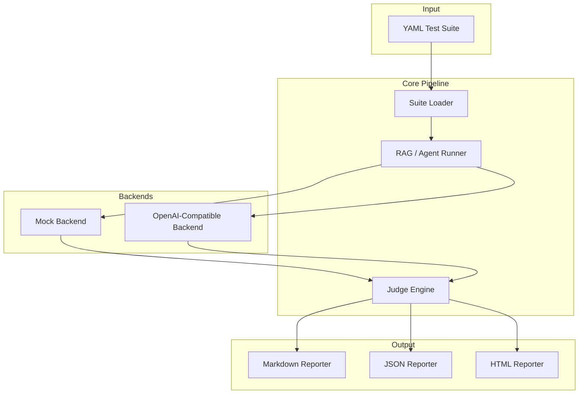

# Architecture

## System Overview

EvalForge follows a pipeline architecture where test definitions flow through runners, backends, judges, and reporters.



## Data Flow

```
1. YAML Suite File
   ↓ (parsed by SuiteLoader)
2. TestSuite (Pydantic model)
   ↓ (iterated by Runner)
3. TestCase → Backend.query(prompt, context)
   ↓ (returns BackendResponse)
4. BackendResponse → Judge.judge(test_case, response)
   ↓ (returns JudgeResult)
5. JudgeResult → aggregated into TestResult
   ↓ (collected into TestRunResult)
6. TestRunResult → Reporter.generate(report)
   ↓ (writes to disk)
7. Report file (Markdown / JSON / HTML)
```

## Component Descriptions

### Suite Loader (`evalforge/loader/`)
Parses YAML test suite files into validated Pydantic models. Handles include directives, validates required fields, and returns clear error messages for malformed input.

### Runners (`evalforge/runners/`)
Orchestrate test execution. The RAG runner handles single-turn Q&A evaluation. The Agent runner handles multi-step tool-use sequences. Both use async execution for parallel test runs.

### Backends (`evalforge/backends/`)
Abstract interface to AI model providers. The mock backend returns pre-configured responses for testing. The OpenAI-compatible backend calls any OpenAI API endpoint (including Azure, local models via Ollama, etc.).

### Judges (`evalforge/judges/`)
Evaluate responses against expected behavior. Each judge type handles a specific evaluation dimension:
- **ExactMatchJudge**: String equality check
- **SemanticMatchJudge**: Embedding-based similarity
- **CitationCheckJudge**: Source citation verification
- **RefusalCheckJudge**: Refusal behavior validation
- **RetrievalCheckJudge**: Document retrieval correctness
- **ForbiddenContentJudge**: Policy violation detection

### Reporters (`evalforge/reporters/`)
Transform evaluation results into human and machine-readable formats. Markdown for quick review, JSON for programmatic access, HTML for presentations and dashboards.

### Models (`evalforge/models/`)
Pydantic v2 models that define the type-safe data contracts throughout the system. All data flows through these validated models.

## Error Handling Strategy

| Error Type | Handling |
|-----------|----------|
| Invalid YAML | Parse error with line number, fail fast |
| Missing backend | Skip suite, report connectivity error |
| Request timeout | Mark test as error, continue remaining tests |
| Judge failure | Log error, mark test as inconclusive |
| Partial results | Generate report with available results |

## Extension Points

- **Custom judges**: Subclass `BaseJudge`, implement `judge()` method
- **Custom backends**: Subclass `BaseBackend`, implement `query()` and `health_check()`
- **Custom reporters**: Subclass `BaseReporter`, implement `generate()` method
- **Test types**: Add to `TestCaseType` enum, create corresponding judge
