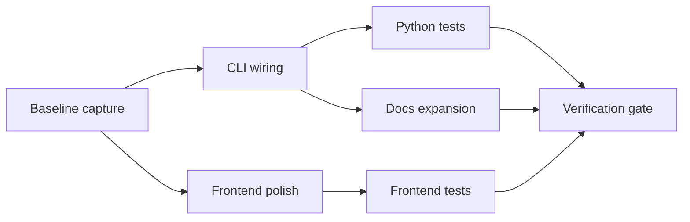

# Execution Plan (historical record)

> This document records the earlier comprehensive-bar pass and its verification
> snapshot. It is retained for provenance; current capability and remaining work live
> in [ROADMAP.md](../ROADMAP.md) and [docs/roadmap.md](roadmap.md).

This document records the plan and outcome of raising EvalForge to the comprehensive
quality bar without regressing the migrated, already-green project. It complements
[design-decisions.md](./design-decisions.md) (the *why*) with the *what* and *in what order*.

## Objectives

1. Expand the test suite to comprehensive coverage (success + error paths).
2. Polish the Next.js dashboard (demo-mode, states, ErrorBoundary, component tests, e2e).
3. Bring the docs to the comprehensive bar with Mermaid diagrams.
4. Wire the documented project-specific capabilities (drift baseline-compare, custom-judge
   plugin loader, scheduled-eval) — additively, never rewriting working internals.
5. Adopt `shared_core` convergence items **only** where scores can be pinned identical.

## Do-no-harm guardrails

- Baseline captured **before** any change: **146 Python tests**, ruff clean, frontend
  `tsc`/`build` green.
- Any change touching a numeric output (scores/costs/similarity) is **golden-output-gated**:
  pin current values in a test first, then refactor. If the value cannot be preserved,
  the change is dropped and recorded as a follow-up.
- The full Python and TypeScript suites must stay at the same or higher count.

## Workstreams

### 1. CLI wiring (additive)
- `baseline set/compare ... --db <path>` — `DriftDetector` compares a report against the
  per-suite baseline stored in the SQLite history store (the file-based default is kept).
- `eval --judge-plugin <file> --judge-plugin-type <type>` — finished the plugin loader via
  `resolve_judge_override()` + `RAGRunner(judge_overrides=...)` (no global-registry mutation).
- `schedule <suite> --backend <b> --save/--no-save --db <path>` — scheduled runs now persist
  to history through the shared `build_backend()` + `HistoryStore.save_run` paths.

### 2. Python test expansion
- `test_semantic_golden.py` — pins the score-sensitive TF-IDF values (golden gate).
- `test_plugin_wiring.py` — `resolve_judge_override` + runner override behavior + isolation.
- `test_cli_wiring.py` — baseline-db set/compare/regression, `--judge-plugin`, scheduled
  eval persistence, and the previously-thin `plugins` / `workspace` / `ci` / `serve` surfaces.
- `test_drift_edge.py` — new-test handling, pass-rate-only regression, custom thresholds.

### 3. Frontend polish
- `lib/api.ts` + `lib/demoData.ts` — demo-mode fallback (deterministic data when the history
  API is unreachable), surfaced via a visible `DemoBanner`.
- Loading / empty / error states on the dashboard; `ErrorBoundary` around the data subtree.
- `vitest` + `@testing-library/react` component tests; a Playwright `demo-mode.spec.ts`.

### 4. Docs
- Expanded `security.md`, `failure-modes.md`, `roadmap.md`, `design-decisions.md` with
  Mermaid diagrams; documented the embeddings golden-gate skip; added this plan.

### 5. Convergence (PRIORITY 2)
- **Skipped, documented:** `semantic_match` → `shared_core.embeddings` (TF-IDF IDF differs;
  scores would drift). Pinned the current values instead.
- **Deferred (golden-gated follow-ups):** judges/drift → `shared_core.evaljudge`; LLM
  backends → `LLMClientFactory`; HF loader → shared ingestion; history store →
  `shared_core.database`.

## Verification gate

| Gate | Command | Result |
|------|---------|--------|
| Lint | `ruff check evalforge tests scripts` | clean |
| Format | `ruff format --check evalforge tests scripts` | clean |
| Python tests | `pytest` | 146 → 183 passing |
| Frontend types | `tsc --noEmit` | clean |
| Frontend unit | `vitest run` | 29 passing |
| Frontend build | `next build` | success |
| Frontend e2e | `playwright test` | 7 passing |

## Outcome

All gates green; Python test count rose 146 → 183 with no regressions; the frontend gained
a vitest suite (29 tests) and a demo-mode e2e spec; the three project-specific capabilities
are wired end-to-end; and the one score-sensitive convergence was correctly skipped and
pinned rather than allowed to drift.

## Subsequent portfolio expansion

The later evidence-pack pass completed the engineering follow-ups that were deferred in
this historical plan: judge calibration, formal agent traces, local provider/ingestion/
repository compatibility contracts, and evidence schema v2. The archived `shared_core`
package is still not restored; only the explicitly attributed config/errors/logging subset
is vendored. Hosted/team workflows, hosted scheduling, Slack/Discord expansion,
multi-model comparison, and prompt versioning remain product deferrals.
