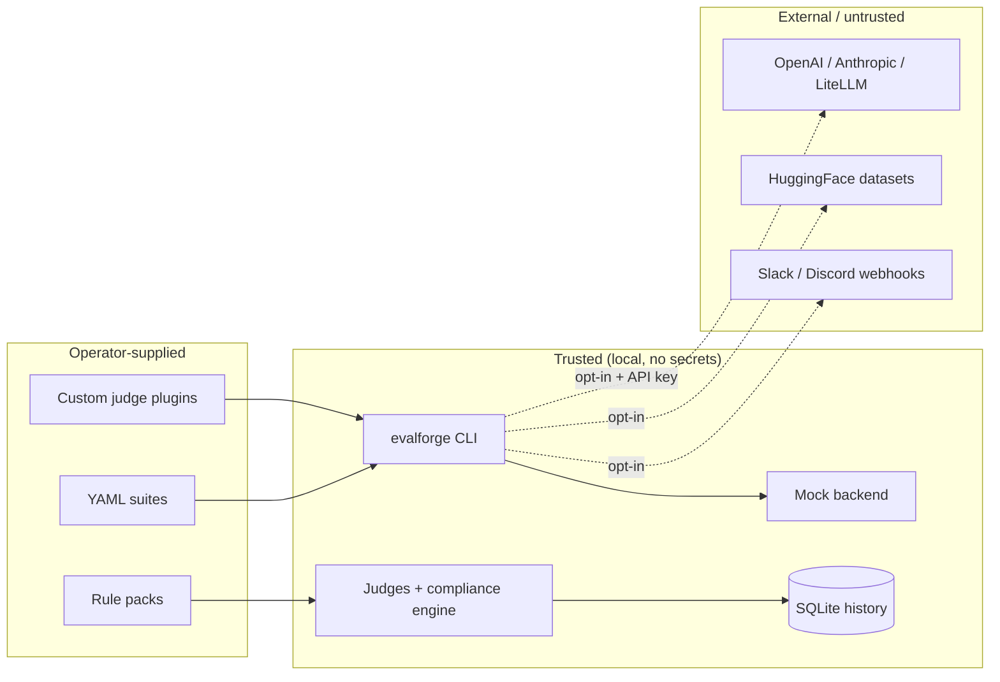

# Security Guide

EvalForge is **offline-first**: by default it runs against the deterministic mock
backend with no network access and no secrets. Real LLM providers and the optional
history API are opt-in. This guide covers the trust boundaries, secret handling, the
plugin sandbox considerations, and the operational checklist.

## Trust boundaries



The dashed edges are the only paths that leave the local trust boundary, and each is
opt-in: a backend other than `mock`, the `--from-hf` flag, or a configured webhook URL.

## Secrets management

### API keys for real backends

API keys are read from the environment via the `EVALFORGE_` prefix (see
`evalforge/config.py`). They are never written to reports or the history database.

```bash
export EVALFORGE_OPENAI_API_KEY=sk-...
evalforge eval suite.yaml --backend openai
```

| Setting | Env var | Notes |
|---------|---------|-------|
| OpenAI key | `EVALFORGE_OPENAI_API_KEY` | Plain `str`; empty by default → semantic judge uses TF-IDF fallback |
| OpenAI base URL | `EVALFORGE_OPENAI_BASE_URL` | Point at Azure / Ollama / a proxy |
| GitHub token (CI) | `GITHUB_TOKEN` | Read by the CI PR reporter; standard Actions secret |

### Mock backend (default — no secrets)

```bash
evalforge eval suite.yaml            # --backend mock is the default
```

No API keys are required. The mock backend matches prompts against a local JSON map and
returns a deterministic default otherwise, so CI on PRs needs no secrets.

## Custom judge plugins

The plugin loader (`evalforge/plugins.py`) executes a user-supplied Python file that
defines a `judge(test_case, response)` function. **A plugin runs with the same privileges
as the CLI** — treat plugin files as trusted code, the same way you treat a test in your
repo. Mitigations built in:

- `validate_plugin()` checks the file exists, is a `.py`, imports cleanly, and exposes a
  2-arg `judge` before it is used — run `evalforge plugins validate --path <file>` in review.
- `discover_plugins()` skips files that fail to import rather than crashing the run.
- A plugin raising at judge time is caught and recorded as a failed `JudgeResult`
  (score 0.0) — a malicious or buggy plugin cannot abort the whole suite.
- Plugins are applied as **scoped runner overrides** (`RAGRunner(judge_overrides=...)`),
  never mutating the global registry, so one suite's plugin cannot leak into another.

Do **not** load plugin files from untrusted sources. If you accept third-party suites,
review their plugin files exactly as you would review a pull request.

## History API

The FastAPI history API (`evalforge serve`) binds to `127.0.0.1` by default and is meant
for local dashboard use. It uses `shared_core` request-logging middleware and the shared
application error handler (so internal errors are not leaked verbatim). If you expose it
beyond localhost, put it behind an authenticating reverse proxy — it has no built-in auth.

## Webhooks

Slack/Discord notifiers are no-ops unless a webhook URL is configured, preserving
offline-first behavior. Webhook URLs are secrets — store them in the environment, not in
suite files.

## Security checklist

- [ ] CI uses the `mock` backend for PRs (no secrets in untrusted contexts)
- [ ] Real API keys live only in protected-branch / environment secrets, never in suites
- [ ] No keys committed in `example_suites/` or rule packs
- [ ] Custom judge plugins are reviewed and `evalforge plugins validate`-ed before use
- [ ] The history API is bound to localhost or fronted by auth if exposed
- [ ] Webhook URLs come from the environment, not from files in the repo
- [ ] `EVALFORGE_OPENAI_BASE_URL` points only at endpoints you trust
