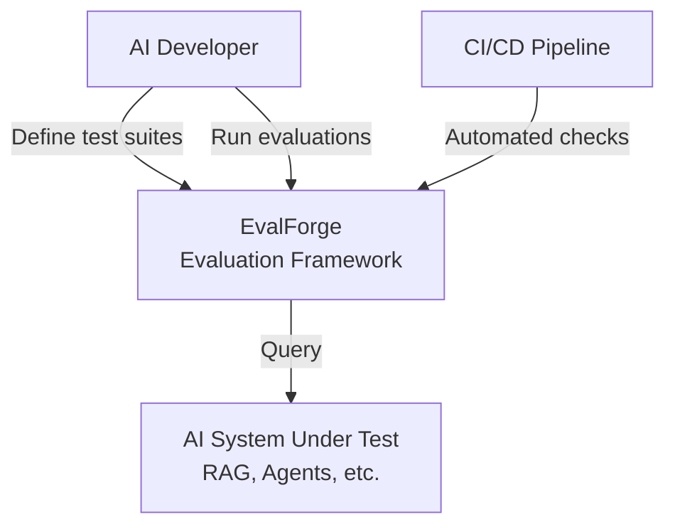
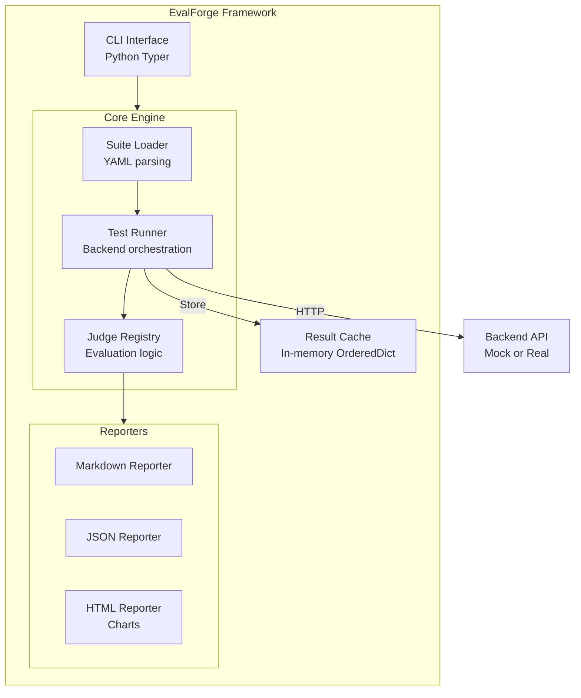
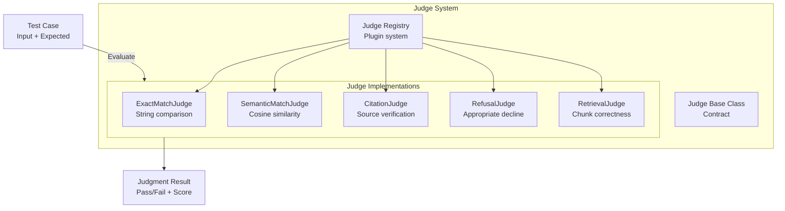
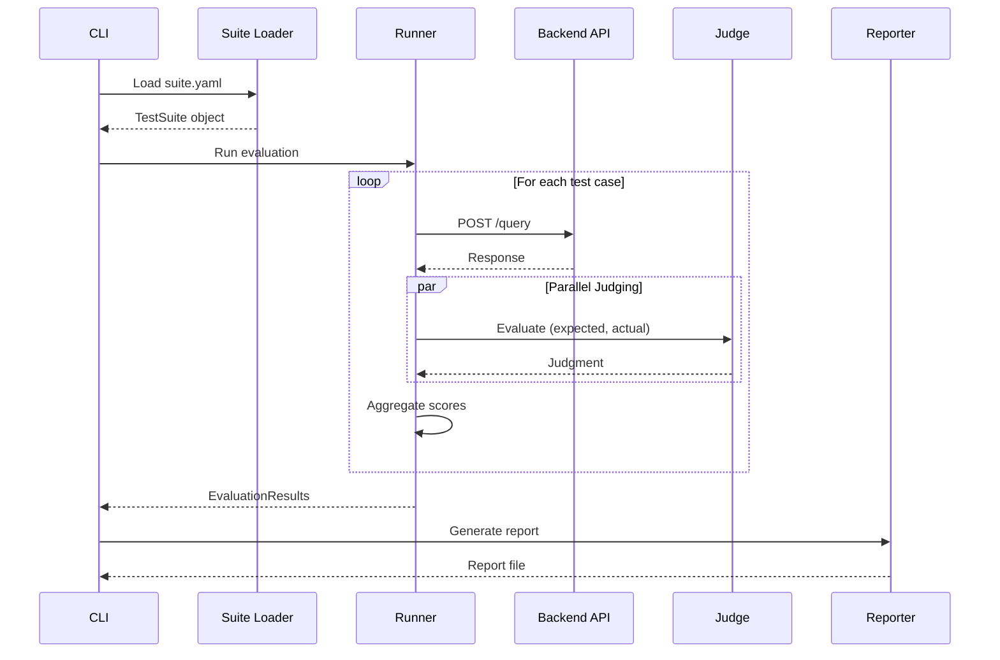
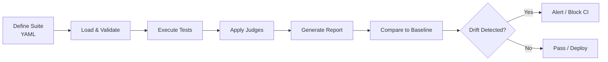

# EvalForge Architecture (C4 Model)

## Context Diagram (C4 Level 1)



## Container Diagram (C4 Level 2)



## Component Diagram (C4 Level 3) - Judge System



## Data Flow - Evaluation Run



## Evaluation Lifecycle



## Key Architectural Decisions

| Decision | Rationale |
|----------|-----------|
| **YAML Test Suites** | Version-controlled, human-readable, diffable |
| **Judge Pattern** | Pluggable evaluation logic; users can extend |
| **Multiple Backends** | Mock for unit tests, real for integration tests |
| **Result Caching** | Avoid re-evaluating unchanged tests |
| **Reporter System** | Multiple output formats for different audiences |
| **Drift Detection** | Statistical comparison across runs |

## Technology Stack

| Layer | Technology |
|-------|------------|
| CLI | Python Typer |
| Core | Pydantic, asyncio |
| Judges | httpx (OpenAI embeddings), Cosine math |
| Cache | In-memory OrderedDict |
| Reporting | Markdown, Jinja2, Chart.js (HTML) |

## Judge Types

| Judge | Use Case | Metric |
|-------|----------|--------|
| ExactMatch | API contracts, deterministic outputs | String equality |
| SemanticMatch | Open-ended generation | Cosine similarity |
| Citation | RAG systems | Source grounding |
| Refusal | Safety, compliance | Appropriate decline |
| Retrieval | Search quality | Chunk relevance |
| LLMJudge | Complex reasoning | LLM-as-judge |

## CI/CD Integration

```yaml
# GitHub Actions example
- name: Run Evaluations
  run: evalforge eval suites/regression.yaml --format json

- name: Check for Drift
  run: evalforge compare --baseline main --current HEAD
```

## Performance Characteristics

| Metric | Target |
|--------|--------|
| Suite loading | <100ms for 1000 tests |
| Test execution | <5s per test (with real backend) |
| Concurrent tests | 10 parallel (configurable) |
| Report generation | <1s |
| Cache lookup | <10ms |
