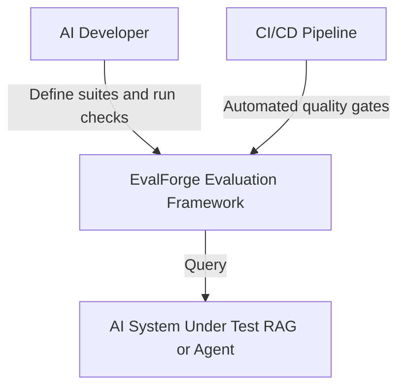
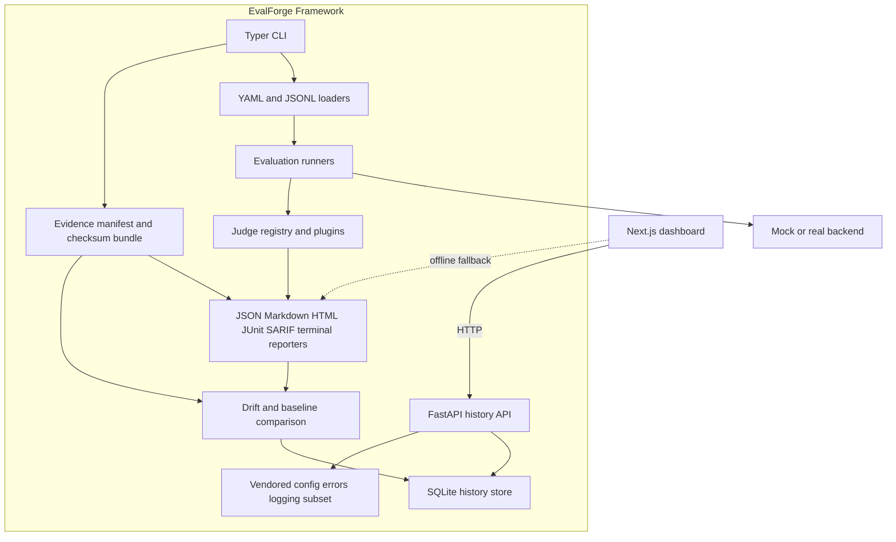
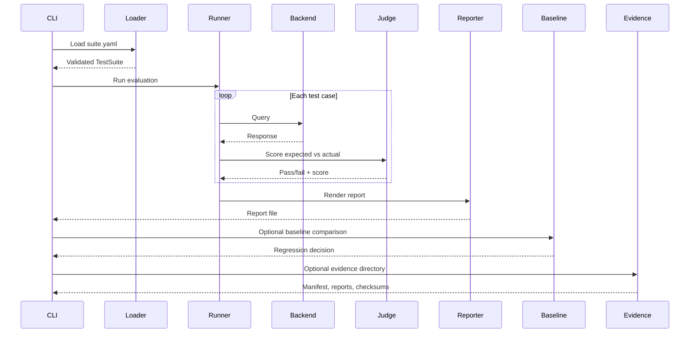

# EvalForge architecture (C4 model)

## Context diagram (C4 level 1)


```mermaid
graph TB
    Developer[AI Developer]
    CICD[CI/CD Pipeline]
    EvalForge[EvalForge Evaluation Framework]
    AITest[AI System Under Test RAG or Agent]

    Developer -->|Define suites and run checks| EvalForge
    CICD -->|Automated quality gates| EvalForge
    EvalForge -->|Query| AITest
```

## Container diagram (C4 level 2)


```mermaid
graph TB
    subgraph EvalForge[EvalForge Framework]
        CLI[Typer CLI]
        Loader[YAML and JSONL loaders]
        Runner[Evaluation runners]
        Judges[Judge registry and plugins]
        Reports[JSON Markdown HTML JUnit SARIF terminal reporters]
        Drift[Drift and baseline comparison]
        Evidence[Evidence manifest and checksum bundle]
        History[SQLite history store]
        API[FastAPI history API]
        Shared[Vendored config errors logging subset]
    end

    Backend[Mock or real backend]
    Dashboard[Next.js dashboard]

    CLI --> Loader
    Loader --> Runner
    Runner --> Backend
    Runner --> Judges
    Judges --> Reports
    Reports --> Drift
    Drift --> History
    CLI --> Evidence
    Evidence --> Reports
    Evidence --> Drift
    API --> History
    API --> Shared
    Dashboard -->|HTTP| API
    Dashboard -.->|offline fallback| Reports
```

## Evaluation lifecycle


```mermaid
sequenceDiagram
    participant CLI
    participant Loader
    participant Runner
    participant Backend
    participant Judge
    participant Reporter
    participant Baseline
    participant Evidence

    CLI->>Loader: Load suite.yaml
    Loader-->>CLI: Validated TestSuite
    CLI->>Runner: Run evaluation
    loop Each test case
        Runner->>Backend: Query
        Backend-->>Runner: Response
        Runner->>Judge: Score expected vs actual
        Judge-->>Runner: Pass/fail + score
    end
    Runner->>Reporter: Render report
    Reporter-->>CLI: Report file
    CLI->>Baseline: Optional baseline comparison
    Baseline-->>CLI: Regression decision
    CLI->>Evidence: Optional evidence directory
    Evidence-->>CLI: Manifest, reports, checksums
```

## Key decisions

| Decision | Rationale |
|---|---|
| CLI-first root package | The Typer CLI is the headline surface; the API is secondary. |
| Separate judges | Evaluation strategies remain composable and extensible. |
| Mock backend | Suites and CI can run deterministically without credentials. |
| SQLite history | Local, zero-configuration persistence supports the dashboard. |
| Vendored shared subset | Config and API infrastructure are independently installable and provenance-pinned. |
| Golden-output gates | Score-sensitive migrations cannot silently change stored baselines. |

## Technology stack

| Layer | Technology |
|---|---|
| CLI and core | Python 3.11+, Typer, Pydantic, asyncio |
| Backends | Mock, OpenAI-compatible HTTP, Anthropic, LiteLLM, HuggingFace fallback |
| Judges | Exact, semantic, citation, refusal, retrieval, forbidden, structured, LLM |
| Persistence | SQLite history and baseline store |
| API | FastAPI with vendored request logging and application errors |
| Dashboard | Next.js, React, Vitest, Playwright |

## CI integration

```yaml
- name: Run offline evaluations
  run: evalforge eval example_suites/rag_basic.yaml --backend mock --format json

- name: Compare against a stored baseline
  run: evalforge baseline compare reports/current.json --db history.db
```
