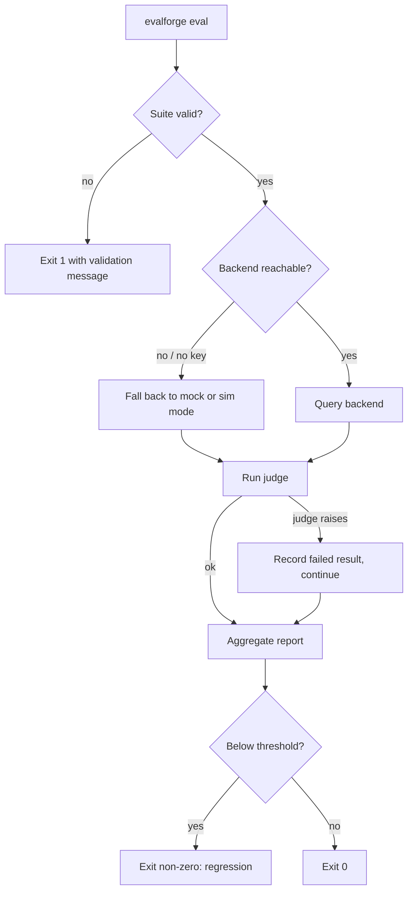

# Failure Modes

EvalForge is built to **degrade gracefully and offline-first**: a missing backend, a bad
plugin, or an absent optional dependency narrows functionality but never aborts the run.
This document enumerates the known failure modes, how each is detected, and the mitigation.

## Quality regression (the point of the tool)
- **Cause:** a model/prompt/retrieval change lowers pass rate or average score.
- **Detection:** `evalforge drift <baseline.json> <current.json>` compares two report files,
  or `evalforge baseline compare <report.json> --db <history.db>` compares against the
  stored per-suite baseline in the history DB. The CLI exits non-zero (and CI fails) when a
  regression exceeds the threshold.
- **Mitigation:** gate deploys on the drift/baseline check; store a baseline per suite
  (`evalforge baseline set <report.json> --db <history.db>`).

## Backend unavailable / no API key
- **Cause:** OpenAI/Anthropic unreachable or unconfigured.
- **Detection:** backend request errors (with tenacity retries); per-test errors are
  captured and the test is marked failed rather than crashing the suite.
- **Mitigation:** the deterministic **mock** backend (and the sim execution mode) run
  evaluations fully offline — the demo, tests, and CI mock job rely on this. The dashboard
  has a matching **demo-mode** fallback so the UI works with no history API running.

## Invalid suite definition
- **Cause:** malformed YAML or missing required fields.
- **Detection:** `loader.suite_loader.validate_suite`.
- **Mitigation:** the CLI exits with code 1 and a clear validation message (tested).

## Custom judge plugin failure
- **Cause:** a plugin file is missing, fails to import, lacks a `judge` function, has a bad
  signature, targets an unknown test-case type, or raises at judge time.
- **Detection:** `validate_plugin()` / `resolve_judge_override()` raise before the run with a
  precise message (`evalforge eval ... --judge-plugin` exits 1 and prints the reason);
  `discover_plugins()` silently skips un-loadable files.
- **Mitigation:** a plugin that raises *during* judging is caught and recorded as a failed
  `JudgeResult` (score 0.0), so one bad plugin cannot abort the suite. Overrides are scoped
  to a single runner and never mutate the global registry.

## Scheduled evaluation does not persist
- **Cause:** APScheduler is not installed (offline/demo env) or the history DB write fails.
- **Detection:** the scheduler logs a warning and runs the job immediately when APScheduler
  is absent; a DB write error is caught and surfaced as a yellow warning.
- **Mitigation:** `evalforge schedule <suite> --backend mock --db <path>` runs once inline
  and still saves the report when possible; `--no-save` opts out of persistence entirely.

## Optional dependency missing (HF datasets)
- **Cause:** the `hf` extra (datasets/transformers/torch) isn't installed.
- **Mitigation:** `datasets/huggingface_loader.py` falls back to a synthetic offline
  dataset, so suites that reference HF benchmarks still run.

## Compliance rule violation
- **Cause:** output violates a rule pack (PII, forbidden content, format, range, bias).
- **Detection:** the deterministic `compliance` engine.
- **Mitigation:** violations are reported per-rule (SARIF output integrates with code
  scanning); no LLM call required, so results are reproducible.

## Score drift from infrastructure changes
- **Cause:** swapping a judge/similarity implementation changes numeric scores. Concretely,
  the bespoke TF-IDF IDF formula (`log(1 + doc_count / df)`) differs from
  `shared_core.embeddings.tfidf_cosine`, so rerouting would shift stored baselines.
- **Detection:** `tests/test_semantic_golden.py` pins the exact 4-dp TF-IDF scores
  (`0.7551`, `0.6808`, `0.3553`); any drift fails the suite.
- **Mitigation:** the domain judges/similarity are kept stable; any future convergence onto
  `shared_core` must keep those golden values identical or be skipped (see
  [roadmap.md](./roadmap.md) and [design-decisions.md](./design-decisions.md)).
