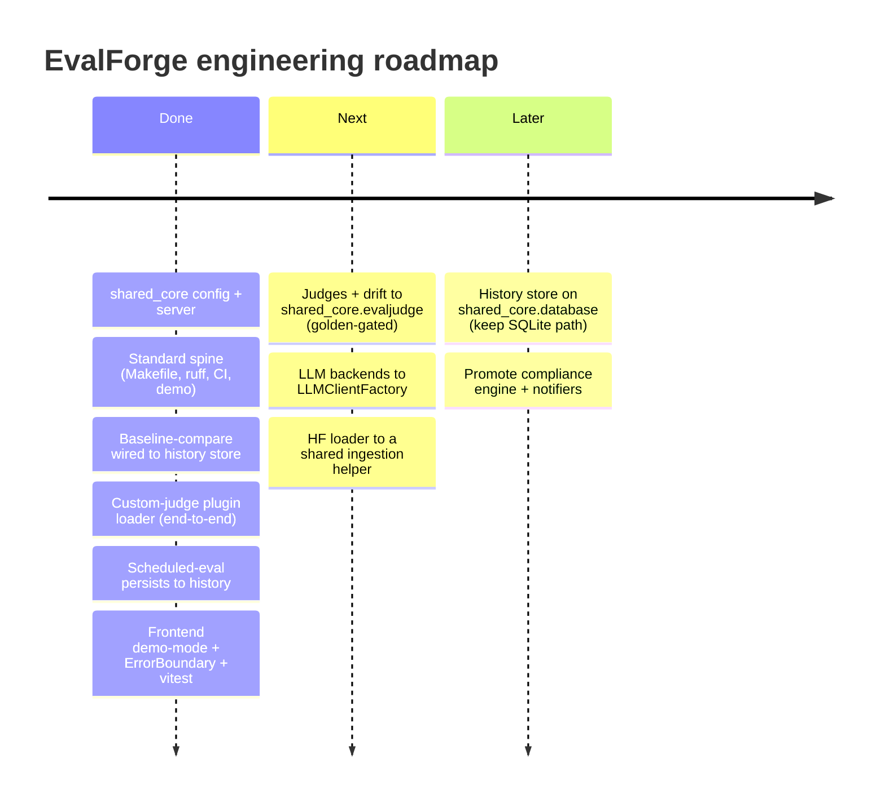

# Roadmap

Product roadmap: [../ROADMAP.md](../ROADMAP.md). This file tracks the engineering
follow-ups from the migration onto `shared_core` and the comprehensive-bar pass.

## Now (done)
- ✅ `config` extends `shared_core.config.BaseAppConfig` (EVALFORGE_ prefix preserved).
- ✅ History API uses `shared_core` error handler + request-logging middleware.
- ✅ Standard spine (Makefile, ruff at repo root, pyright, CI installing shared-core,
  offline demo, optional pgvector/redis compose).
- ✅ **Drift detector wired to a baseline-compare flow** backed by the SQLite history store
  (`evalforge baseline set/compare <report> --db <path>`), keyed by suite name — the same
  baseline the history API and dashboard read.
- ✅ **Custom-judge plugin loader finished** end-to-end: `resolve_judge_override()` turns a
  plugin file into a `(TestCaseType, CustomJudge)` override that `evalforge eval
  --judge-plugin <file> --judge-plugin-type <type>` applies via scoped `RAGRunner`
  overrides (no global-registry mutation).
- ✅ **Scheduled-eval option** runs against a chosen `--backend` and persists each run to the
  history DB (`evalforge schedule <suite> --backend <b> --db <path>`, `--no-save` to opt out).
- ✅ **Frontend** demo-mode fallback (works with no backend), loading/empty/error states,
  an `ErrorBoundary`, vitest component tests, and a Playwright demo-mode smoke spec.

## Next — domain-capability convergence (golden-output-gated)
Each is score-sensitive; do it only with before/after golden-output tests over
`example_suites/` so EvalForge's own regression baselines don't drift:
- Judges + drift detection → `shared_core.evaljudge` (the shared `Judge`/`DriftDetector`).
- LLM backends → `shared_core.llm.LLMClientFactory`.
- HF dataset loader → a shared dataset/ingestion helper.

### Skipped (golden-gate failed) — `semantic_match` → `shared_core.embeddings`
Attempted and **deliberately not adopted**. The bespoke TF-IDF fallback uses an IDF of
`log(1 + doc_count / df)`; `shared_core.embeddings.tfidf_cosine` uses a different IDF, so
identical inputs produce different scores (e.g. `0.7551` vs `0.8771`). Rerouting would
silently shift every stored semantic baseline. The current scores are now pinned in
`tests/test_semantic_golden.py`; the convergence is a follow-up that must reproduce those
exact values (or stay skipped). Jaccard *is* identical across both implementations, but it
is only the tertiary fallback, so swapping it alone adds risk for no benefit.

## Later
- Optionally back the history store with `shared_core.database` while keeping the offline
  SQLite CLI path.
- Promote the compliance rule engine and slack/discord notifiers if a second consumer appears.

## Intentionally not building (now)
- Moving the package under `apps/api/src/` (the CLI-first layout is the project's identity).
- Rerouting `logging.py` through `shared_core.logging` (its `_JSONFormatter` is unit-tested).
